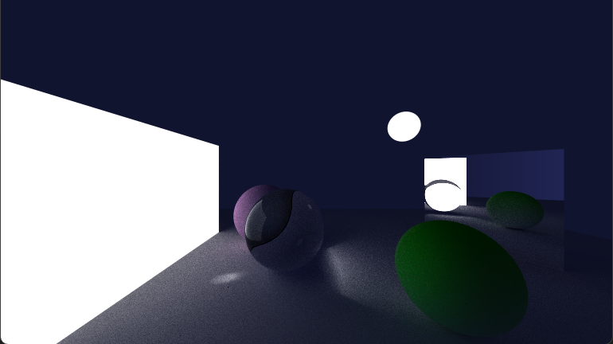

# Orecchiette
Real Time Path Tracer, please read this README!


# Clone and build

Clone with all the submodules using 

`git clone git@github.com:marsicplusplus/Orecchiette.git --recursive`

### Linux

```
cd Orecchiette
mkdir build
cd build
cmake .. -DCMAKE_BUILD_TYPE=debug
make
```
### Windows
Visual Studio should be able to parse the CMake file and create the solution files accordingly.
Please add to the .gitignore any file/folder created by VS that's not in there already to avoid pushing them by mistake.

# Contribution guidelines

We are all friends here, but let's try and keep this thing civil to avoid destroying each other code!

Ideally:
- Each new feature would be implemented in a new branch feature/<name>;
- Each bug would be solved in a new branch bug/<name>;
- Let's try and use the Pull Requests system to merge to master. Would be nice to have the two not submitting the PR reviewing/accepting the code;
- For each item you are working on, move the Trello Card into the relevant column and assign the task to yourself if applicabile;
  
[Trello Board](https://trello.com/b/gVuxBGSr/orecchiette)

# Resources
Some useful references and papers:
- [Mitsuba renderer documentation](https://mitsuba2.readthedocs.io/en/latest/index.html)
- [PBR](https://pbr-book.org/3ed-2018/)
- [Crash Course in BRDF w/ code sample](https://github.com/boksajak/brdf)
